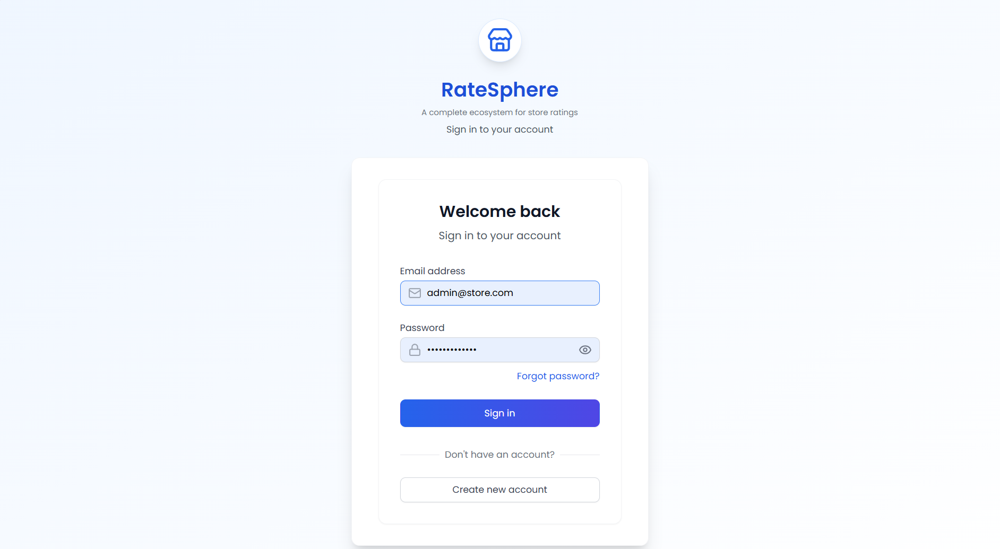

# Store Rating Web Application — RateSphere

> Built by Muskan for the FullStack Intern Coding Challenge — September 2025  
> Location: Hingna, Maharashtra, India

RateSphere is a full-stack web application that enables users to rate local stores, with tailored dashboards for System Administrators, Normal Users, and Store Owners. Built with secure JWT-based authentication and a clean Tailwind UI, it’s designed for real-world usability, analytics, and role-based control.

---

## Tech Stack

- Backend: Express.js (Node.js) with MVC architecture  
- Database: MongoDB (Atlas)  
- Frontend: React.js (JSX), Vite, Axios, Context API  
- Styling: Tailwind CSS v4  
- Authentication: JWT-based login system

---

## User Roles & Functionalities

### System Administrator
- Add new stores, normal users, and admin users
- Dashboard displays:
  - Total number of users
  - Total number of stores
  - Total number of submitted ratings
- Add users with: Name, Email, Password, Address
- View and filter stores by: Name, Email, Address, Rating
- View and filter users by: Name, Email, Address, Role
- View full user details (including ratings if Store Owner)
- Log out

### Normal User
- Sign up with: Name, Email, Address, Password
- Log in and update password
- View all registered stores
- Search stores by Name and Address
- Store listings display:
  - Store Name
  - Address
  - Overall Rating
  - User's Submitted Rating
  - Option to submit or modify rating
- Log out

### Store Owner
- Log in and update password
- Dashboard displays:
  - List of users who rated their store
  - Average rating of their store
- Log out

---

## Features

- Dark mode toggle  
- Role-based login system (JWT)  
- Admin dashboard with live analytics  
- Store listing with rating submission and modification  
- Search and filter by Name, Email, Address, Role  
- Sorting (A–Z / Z–A) for stores and users  
- View full user details (including ratings for Store Owners)  
- Form validations for all inputs  
- Clean, responsive UI with Tailwind CSS

---

## Screenshots

### System Administrator
- 
- 
- 
- 
- 
- 
- 
- 

### Normal User
- 
- 
- 
- 
- 

### Store Owner
- 
- 
- 

### Other UI Elements
- 
- 
- 

---

## Form Validations

- Name: 20–60 characters  
- Address: Up to 400 characters  
- Password: 8–16 characters, must include at least one uppercase letter and one special character  
- Email: Must follow standard email format

---

## Deployment

- Platform: Render  
- Build Tool: Vite  
- Environment Variables: Managed via `.env` and `.env.example`  
- Frontend Served from Backend: `client/dist` integrated into Express

---

## Live Demo
Check out the deployed site here: [bright-brioche-d3290d.netlify.app](https://bright-brioche-d3290d.netlify.app)

---

##  Live Backend

The backend is deployed on Railway and available at:

🔗 [https://ratesphere-backend-production.up.railway.app](https://ratesphere-backend-production.up.railway.app)

You can test API endpoints like `/api/auth/login` or `/api/auth/register` using Postman or the connected frontend.

---

## Test Credentials

### Admin  
- Email: admin@store.com  
- Password: AdminPass123!

### Normal User  
- Email: madankarmuskan@gmail.com
- Password: Muskan@1234

### Store Owner  
- Email: fancy@gmail.com 
- Password: Fancy@1234

---

## Setup Instructions

This project is already deployed.  
To run locally:

1. Clone the repository
2. Install dependencies:
   ```bash
   npm install
   cd client
   npm install