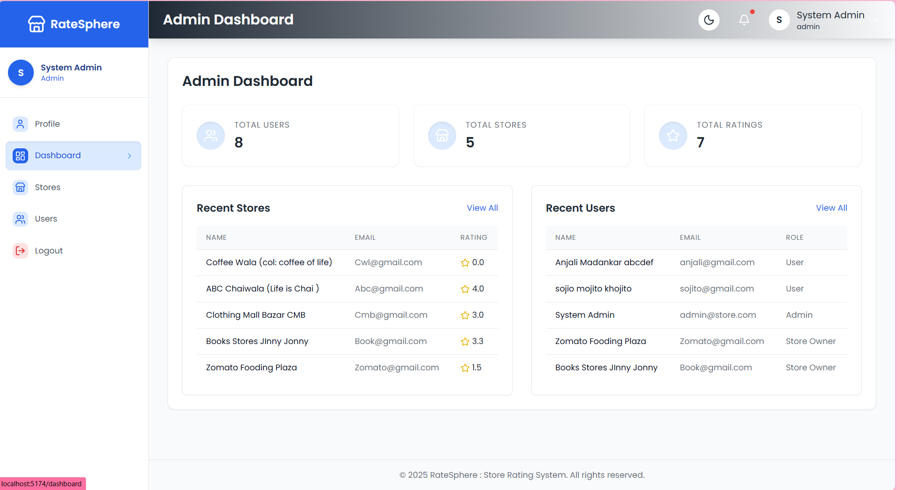
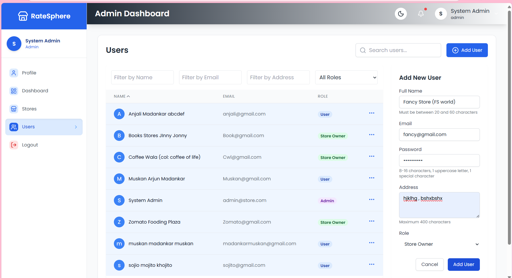
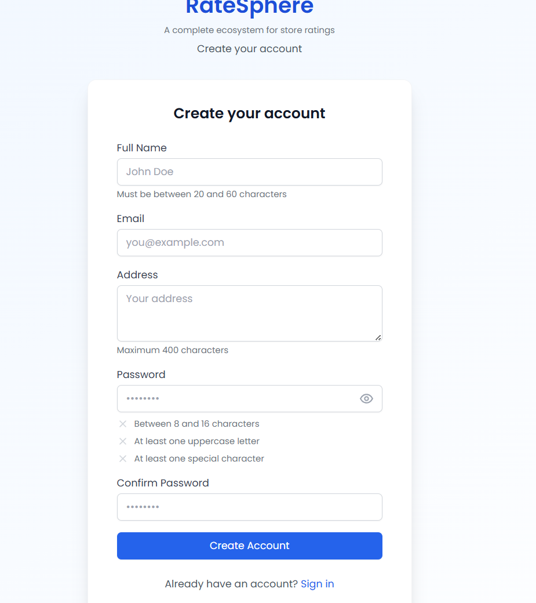
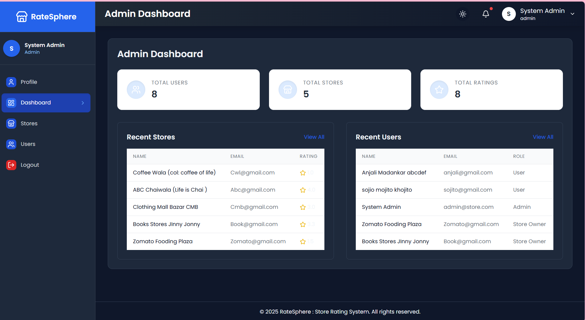

# Store Rating Web Application (RateSphere)

> Built by Muskan for the FullStack Intern Coding Challenge — September 2025  
> Location: Hingna, Maharashtra, India

RateSphere is a full-stack web application that enables users to rate local stores, with tailored dashboards for admins, users, and store owners. Built with secure JWT-based authentication and a clean Tailwind UI, it’s designed for real-world usability, analytics, and role-based control.

This web application allows users to rate stores registered on the platform. It features a role-based access control system, offering different functionalities to System Administrators, Normal Users, and Store Owners.

---

## Tech Stack

- **Backend:** Express.js (Node.js framework) with MVC architecture
- **Database:** MongoDB
- **Frontend:** React.js (JSX), Axios for API calls, Context API for state management, Vite as the build tool, and Tailwind CSS v4 for styling
-**Authentication:** JWT-based login system

---

## User Roles

### 1. System Administrator
- Add new stores, normal users, and admin users
- Dashboard displays:
  - Total number of users
  - Total number of stores
  - Total number of submitted ratings
- Add users with: Name, Email, Password, Address
- View and filter stores by: Name, Email, Address, Rating
- View and filter users by: Name, Email, Address, Role
- View full user details (including ratings if Store Owner)
- Log out

### 2. Normal User
- Sign up with: Name, Email, Address, Password
- Log in and update password
- View all registered stores
- Search stores by Name and Address
- Store listings display:
  - Store Name
  - Address
  - Overall Rating
  - User's Submitted Rating
  - Option to submit or modify rating
- Log out

### 3. Store Owner
- Log in and update password
- Dashboard displays:
  - List of users who rated their store
  - Average rating of their store
- Log out

---

##  Features
- Dark mode toggle
- Role-based login system (JWT)
- Admin dashboard with live analytics
- Store listing with rating submission and modification
- Search and filter by Name, Email, Address, Role
- Sorting (A–Z / Z–A) for stores and users
- View full user details (including ratings for Store Owners)
- Form validations for all inputs
- Clean, responsive UI with Tailwind CSS

---

##  Screenshots

### System Administrator
  
  
  
  
  

### Normal User
  
  
  
  

### Store Owner
  

### Other UI Elements
  
  

---

## Form Validations

- **Name:** Minimum 20 characters, maximum 60 characters
- **Address:** Maximum 400 characters
- **Password:** 8–16 characters, must include at least one uppercase letter and one special character
- **Email:** Must follow standard email format

---
## Deployment

- **Platform:** Render  
- **Build Tool:** Vite  
- **Environment Variables:** Protected via `.env` and `.env.example`  
- **Frontend Served from Backend:** `client/dist` integrated into Express

---

## Live Demo

🌐 Live Demo: [ratesphere-backend.onrender.com]( https://ratesphere-backened.onrender.com)

## Test Credentials
**Admin** 
Email: Pohewala@example.com  
Password: Pohe@wala  

**Normal User**
Email: madankarmuskan@gmail.com  
Password: muskan@Madankar  

**Store Owner**
Email: sojito@gmail.com  
Password: Soji@to1  

---
## Setup Instructions

This project is already deployed. If you'd like to run it locally, feel free to explore the source code and configure it as needed.